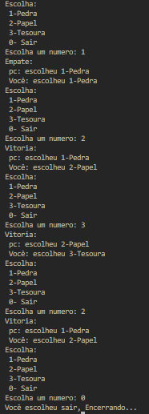

## Sistema com a logica da brincadeira pedra,papel,tesoura, atividade em python com conhecimentos basicos da linguagem.
### Atividade com objetivo de aprender conceito basico de logica de programação em python, essa atividade foi solicitada na faculdade

